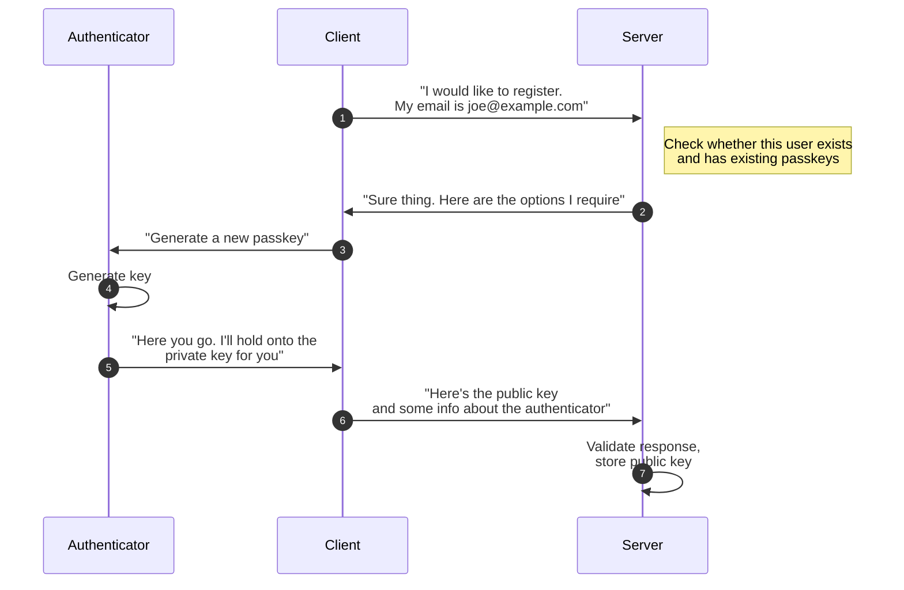

Registration is one of two ceremonies defined in the WebAuthn specification. The registration ceremony is used to register a new passkey with a Relying Party that can be used to authenticate the user in the future.

# The process
The basic process for the WebAuthn registration ceremony is that the Relying Party supplies passkey creation options along with a one-time challenge that is passed to the WebAuthn API on the client. The user selects among the available authenticators that meet the requirements of the creation options from the Relying Party, authorizes the action, and then the response is sent back to the Relying Party for validation and storage.

[//]: # (TODO : render diagram)

# The options
The Relying Party provides `PublicKeyCredentialCreationOptions` during a registration ceremony. These options include information about the Relying Party, the user, and requirements for authenticator selection. The authenticator selection criteria allow the Relying Party to restrict eligible authenticators to meet security or workflow requirements. A few of the most important options are:

* The Relying Party identifier is used to scope the passkey. It must match the browser's effective origin or a registrable suffix of the origin.
* The signature algorithms that the Relying Party allows. The selected algorithm could affect the security of the passkey.
* The preferred authenticator attachment. This value is mainly used to help the user select an authenticator that is most appropriate for the current use case.
* The user verification requirement. The ability to provide user verification enhances the security of the ceremony, but it may not be necessary for all use cases.

The WebAuthn specification has more information on [options for credential creation](https://www.w3.org/TR/2021/WD-webauthn-3-20210427/#dictionary-makecredentialoptions).

# The validation
The authenticator response is returned to the client via the WebAuthn API and then passed along to the Relying Party server for validation. The Relying Party should validate a number of fields on the response and compare them against its requirements and other options provided when the registration ceremony was started. A few of the more important fields to validate are:

* The challenge. This must match the challenge provided as part of the creation options.
* The origin. This must match the Relying Party's origin.
* The user presence flag. User presence is always required. The user verification flag should be set if it was requested.
* The signature algorithm. The Relying Party should verify that the signature algorithm identifier matches one of those requested.
* The attestation. Attestation is covered in its own section below.

If the response is successfully validated, the Relying Party should store the passkey information, including the credential identifier and public key, for future authentication ceremonies.

# The attestation
Attestation is used to verify the authenticity of the authenticator and provide assurances about its features. This information can be used by the Relying Party to aid in making a trust decision for a particular authenticator. Attestation is provided by authenticators in a variety of [types](https://www.w3.org/TR/2021/WD-webauthn-3-20210427/#sctn-attestation-types) and [formats](https://www.w3.org/TR/2021/WD-webauthn-3-20210427/#sctn-defined-attestation-formats). The general guidance is that Relying Parties should not require attestation during passkey registration unless it is necessary for security reasons. See the WebAuthn specification for more information on attestation.